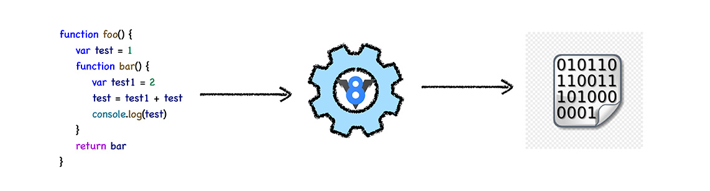
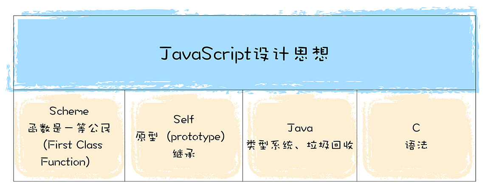

## 浏览器内核
浏览器的内核主要有两个部分，一部分是渲染引擎，另一部分是 JavaScript 引擎。现在JS引擎比较独立，内核更加倾向于说渲染引擎。

浏览器的**渲染引擎**，有以下几种：
- **Trident**，此内核只能用于 Windows 平台，并且不开源。代表浏览器有 IE 浏览器，腾讯浏览器，360 浏览器， Maxthon（遨游）等
- **EdgeHTML**，Edge 浏览器
- **Gecko**，能跨平台，开源。代表浏览器比如 Firefox
- **Webkit**，开源。代表浏览器是，Safari，曾经的 Chrome。内置了 JavaScriptCore 引擎。
- **Blink**，现在的 Chrome。

**JavaScript 引擎**的种类有：
- **JScript**，IE 8 及以下
-  **Chakra**，IE 9 + 及 Edge 浏览器
- **SpiderMonkey**，内置于 Gecko
- **V8**，内置于 Blink
- **JavaScriptCore**，内置于 Webkit

## 什么是 V8
V8 是 JavaScript 引擎的一种。主要作用是将 JavaScript 翻译成机器语言。

在 V8 出现之前，所有的 JavaScript 引擎都是采用解释执行的，这是 JavaScript 执行速度过慢的一个主要原因。V8 率先引入了即时编译（JIT）的双轮驱动的设计，这是一种权衡策略，混合编译执行和解释执行这两种手段，给 JavaScript 的执行速度带来了极大的提升。另外，V8 也引入了惰性编译、内联缓存、隐藏类等机制，进一步优化了 JavaScript 代码的编译执行效率。

## 如何学习 V8
V8 的主要功能，就是结合 JavaScript 语言的特性和本质来编译执行它。

首先了解下 JavaScript 这门语言的基本特性和设计思想。JavaScript 借鉴了很多语言的特性，比如C语言的基本语法、Java 的类型系统和内存管理、Scheme 的函数作为一等公民，还有 Self 基于原因的继承机制。

V8 是 JavaScript 的实现，在学习 V8 工作原理时，要格外关注 JavaScript 这些独特的设计思想和特性背后的实现。比如，为了实现函数是一等公民的特性，JavaScript 采取了对象的策略；为了实现原型继承，V8 为每个对象引入了 `__proto__` 属性。

V8 执行 JavaScript 代码的完整流程如下：

编译流水线本身并不复杂，但是其中涉及到了很多技术，诸如 JIT、延迟解析、隐藏类、内联缓存等。

除了分析编译流水线，还需要了解另外两个非常重要的特性，那就是**事件循环系统**和**垃圾回收机制**

