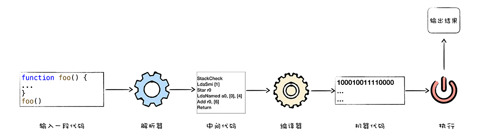

## 什么是 V8
V8 是一个由 Google 开发的开源 JavaScript 引擎，目前用在 Chrome 浏览器和 Node.js 中，其核心功能是执行易于人类理解的 JavaScript 代码。


执行 JavaScript 的核心流程分为编译和执行两步。首先需要将 JavaScript 代码转换为低级中间代码或者机器能够理解的机器代码，然后再执行转换后的代码并输出执行结果。


可以把 V8 看成是一个虚构出来的计算机，也称为虚拟机，虚拟机通过模拟实际计算机的各种功能来实现代码的执行，如模拟实际计算机的 CPU、堆栈、寄存器等，虚拟机还具有他自己的一套指令系统。

不同的 CPU 有不同的指令集，也可以叫**机器语言**。CPU 只能识别二进制的指令。我们将二进制指令集转换为人类可以识别和记忆的符号，叫**汇编语言。**

```
1000100111011000 机器指令
mov ax,bx        汇编指令
```


虽然汇编语言对机器语言做了一层抽象，减少了程序员理解机器语言的复杂度，但是汇编语言依然是复杂且繁琐的，即使写一个非常简单的功能，也需要实现大量的汇编代码，这主要表现在以下两点：
- 不同的 CPU 有着不同的指令集，如果要使用机器语言或者汇编语言来实现一个功能，那么你需要为每种架构的 CPU 编写特定的汇编代码。

- 在编写汇编代码时，我们还需要了解和处理架构相关的硬件知识，比如寄存器、内存、操作 CPU 等。因此我们需要一种拼比了计算机架构细节的语言，能够适应多种不同 CPU 架构的语言，能专心处理业务逻辑的语言，诸如 C、C++、Java、Python、JavaScript 等这些**高级语言**。

### 计算机执行高级语言的两种基本方式
- 解释执行，需要将输入的源代码通过解析器编译成中间代码，之后用解释器解释执行中间代码，然后输出结果。

 

- 编译执行，先将源代码转换成中间代码，然后编译器将中间代码编译成功机器代码。通常编译出来的机器代码以二进制文件形式存储，需要执行这段程序的时候执行二进制文件就可以了。还可以使用虚拟机将编译后的机器代码保存在内存中，然后执行内存中的二进制代码。\



计算机执行不同的高级语言的实现方式有很大的差异。比如执行 C 语言编写的代码，需要先编译为二进制代码的文件，然后再直接执行二进制代码。而对于Java、JavaScript语言等，需要不同的虚拟机，模拟计算机这个编译执行流程。

JavaScript 有好几种流行的虚拟机，比如 Safari 中使用的 JavaScriptCore，Firefox 中使用的是 SpiderMonkey，Chrome 使用的 V8。

## V8 是如何执行 JavaScript 代码的
所以 V8 执行 JavaScript 采用了上面那种方式呢？

实际上，V8 混合了编译执行和解释执行这两种手段。我们把这种混合使用编译器和解释器的技术成为 **JIT** （Just In Time）技术。

这是一种权衡策略，因为这两种方法都各自有各自的优缺点，解释执行的启动速度快，但是执行时速度慢，而编译执行的启动速度满，但是执行的速度快。

以下是 V8 执行 JavaScript 的流程图：


先看上图中的最左边的部分，在 V8 启动执行 JavaScript 之前，它还需要准备执行 JavaScript 时所需要的一些基础环境，包括“堆空间”、“栈空间”、“全局执行上下文”、“全局作用域”、“消息循环系统”、“内置函数” 等，这些都是在执行 JavaScript 过程中需要使用到的，比如：
- JavaScript 全局执行上下文就包含了执行过程中的全局信息，比如一些内置函数，全局变量等
- 全局作用域包含了一些全局变量，在执行过程中的数据都需要存放到内存中
- V8 采用了经典的堆和栈的管理内存管理模式，所以还初始化了内存中的堆和栈结构
- 消息循环系统包含了消息驱动器和消息队列，它如同 V8 的心脏，不断接受消息并决策如何处理消息

基础环境准备好之后，接下来就可以向 V8 提交要执行的 JavaScript 代码了。

首先 V8 接收到 JavaScript 源码后，先**结构化**这段字符串，生成抽象语法树(AST)。同时还生成相关的作用域，作用域中存放相关变量。

接下来，生成字节码。字节码是介于 AST 和机器代码的中间代码。但是与特定类型的机器代码无关，解释器可以直接解释执行字节码，或者通过编译器将其编译为二进制的机器代码再执行。

再接下来，解释器按照顺序解释执行字节码，并输出执行结果。

解释器附近的监控，是用来监控在解释器执行字节码的过程中，如果有一段代码会被重复执行多次，就把这段代码标记为**热点代码**。
当某段代码被标记位热点代码后，V8 就会将这段字节码丢给优化编译器，优化编译器把字节码编译成二进制代码，然后再对编译后的二进制代码执行优化操作，优化后的二进制机器代码的执行效率会得到大幅提升。如果之后再执行到这段代码，V8 会优先选择优化后的二进制代码，这样代码的执行速度就大幅提升了。

不过，由于 JavaScript 是一种非常灵活的动态语言，对象的结构和属性是可以在运行时修改的，使得优化之后的代码变成了无效的代码，这时候优化编译器就执行**反优化**操作，经过反优化的代码，下次执行时就会回退到解释器解释执行。


