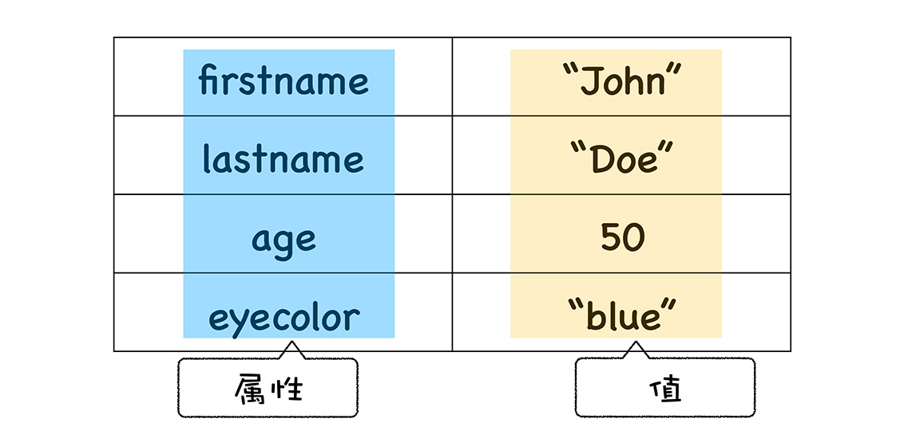
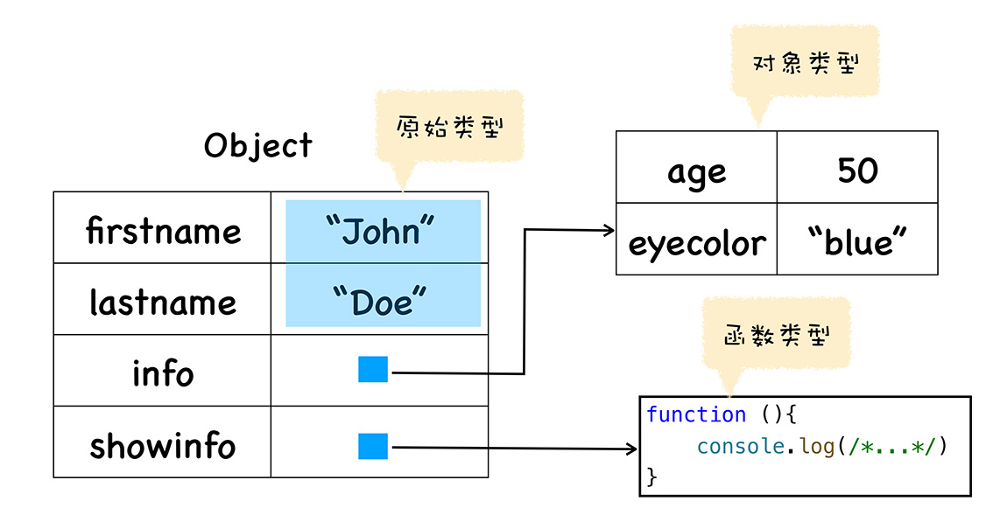

JavaScript 中的函数非常灵活，其根本原因在于 **JavaScript 中的函数是一种特殊的对象**，我们把 JavaScript 中的函数称为**一等公民（First Class Function）。**

基于函数是一等公民的设计，使得 JavaScript 非常容易实现一些特性，比如闭包，还有函数式编程等，而其他语言要实现这些特性就显得比较困难。

## 什么是 JavaScript 中的对象？
JavaScript 是一门**基于对象（Object-Based）**的语言，比如函数、数组都是对象，也可以说 JavaScript 是建立在对象之上的语言。并且这些对象在运行时可以动态修改内容，造就了 JavaScript 的超级灵活特性。


虽然 JavaScript 是基于对象设计的，但它却不是一门**面向对象的语言（Object-Oriented Programming Language）**，因为面向对象语言天生支持**封装、继承、多态**，但是 JavaScript 并没有直接提供多态的支持。

除了对多态支持得不好，JavaScript 实现继承的方式和面向对象的语言实现继承的方式同样存在很大的差异。JavaScript 只是在对象中添加了一个称为原型的属性，把继承的对象通过原型链接起来，就实现了继承，我们把这种继承方式称为基于原型链继承。

其实 JavaScript 中的对象非常简单，每个对象就是由一对对属性和值构成的集合。

```javascript
const person = new Object();
person.firstname = "John";
person.lastname = "Doe";
person.age = 50;
person.eyecolor = "blue";
```


JavaScript 对象的值可以是任意类型的数据，我们再给上面的对象增加两个属性：

```javascript
person.info = new Object();
info.age = 50;
info.eyecolor="blue";
info.eyecolor = "blue";
person.showinfo = function () {console.log('test')}
```



对象的属性有三种类型：
- **原始类型（primitive）**，值本身无法被改变，包括 `null`,`undefined`,`boolean`,`number`,`string`,`bigint`,`symbol`。
- **对象类型（Object）**
- **函数类型（Function）**

## 函数的本质
函数本质上是可以被调用的对象。

V8 是怎么实现函数的可调用特性的呢？ 其实在 V8内部，我们会为函数对象添加两个隐藏属性，分别是 name 属性和 code 属性，具体属性如下所示：


## 函数是一等公民
**如果某个编程语言的函数可以和它的数据类型做一样的事情，我们就把这个语言中的函数称为一等公民。**

在执行 JavaScript 函数过程中，为了实现变量的查找，V8 会为其维护一个作用域链，如果函数中使用了某个变量，但是函数内部又没有定义该变量，那么函数就会沿着作用域链去外部的作用域中查找该变量，具体流程如下：


从图中可以知道，当函数内部引用了外部的变量时，使用这个函数进行赋值、传参或作为返回值，你还需要保证这些被引用的外部变量时确实存在的。这就是让函数作为一等公民麻烦的地方，因为虚拟机还需要处理函数引用的外部变量。
```javascript
function foo() {
  var number = 1
  function bar() {
    number ++
    console.log(number)
  }
}

var myBar = foo()
myBar()
```
“函数是一等公民”就体现在，如果要返回函数 bar 给外部，那么即便 foo 函数执行结束了，其内部定义的 number 变量也不能被销毁，因为 bar 函数依然引用了该变量。

这种将外部变量和函数绑定起来的技术成为**闭包**。

另外基于函数是一等公民，我们可以轻松使用 JavaScript 来实现目前比较流行的函数式编程。

## 总结
函数作为一个对象，可以被赋值、作为参数，还可以作为返回值，那么如果一个函数返回了另外一个函数，那就应该返回该函数所有相关的内容。

- 函数作为一个对象，它有自己的属性和值，所以函数关联了基础的属性和值；
- 函数之所以成为特殊的对象，这个特殊的地方是函数可以“被调用”，所以一个函数被调用时，它还需要关联相关的执行上下文。

结合以上两点，JavaScript 中的函数就实现了 “函数是一等公民” 的特性。


