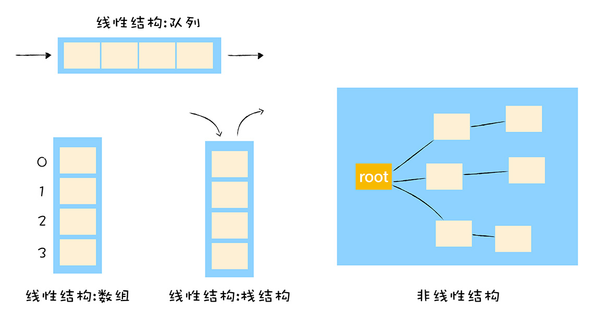
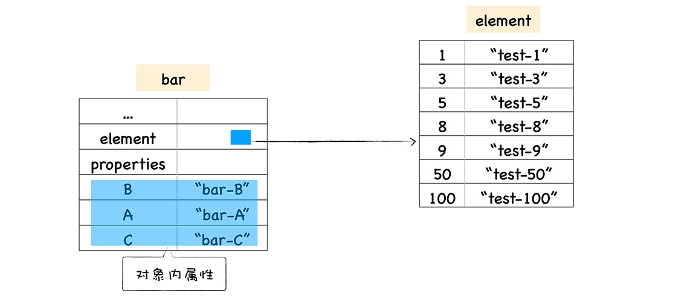

从 JavaScript 语言的角度来看，JavaScript 对象像一个字典，字符串作为键名，任意对象可以作为键值，可以通过键名读写键值。

然而在 V8 实现对象存储时，出于性能的考量，并没有完全采用字典的存储方式，而是为了提升存储和查询效率，采用了一套复杂的存储策略。



接下来分析下 V8 采用了哪些策略提升了对象属性的访问速度。

## 常规属性（properties）和排序属性(element)
什么是对象中的**常规属性**和**排序属性**，参考下面一段代码：
```javascript
function Foo() {
  this[100] = 'test-100';
  this[1] = 'test-1';
  this["B"] = 'bar-B';
  this[50] = 'test-50';
  this[9] = 'test-9';
  this[8] = 'test-8';
  this["A"] = 'bar-A';
  this["C"] = 'bar-C';
}
var bar = new Foo()
for(key in bar) {
  console.log(`index:${key} value:${bar[key]}`)
}
```

打印结果如下：


观察这段打印出来的数据，我们发现打印出来的属性顺序并不是我们设置的顺序，规律如下：
- 设置的数字属性被最先打印出来，并且按照数字升序打印
- 设置的字符串属性依然是按照之前的设置顺序打印的，比如我们是按照 B、A、C 的顺序设置的，打印出来依然是这个顺序。

因为在 ECMAScript 规范中定义了**数字属性应该按照索引值升序排列，字符串属性根据创建时的顺序升序排列。**

我们把数字属性称为**排序属性**，在 V8 中被称为 **elements**，字符串属性被称为**常规属性**，在 V8 中称为 **properties**。

在 V8 内部，为了有效地提升存储和访问这两种属性的性能，分别使用了两个线性数据结构来分别保存排序属性和常规属性，具体结构如下图：


通过上图，我们知道，bar 对象包括两个隐藏属性 elements 属性和 properties 属性分别指向 elements 对象和 properties 对象，elements 对象按照大小顺序存放排序属性，properties 对象按照创建时的顺序存放常规属性。

如果执行索引操作，V8 先从 elements 属性中按照顺序读取所有的元素，然后再在 properties 属性中读取所有的元素。

## 快属性和慢属性
将不同属性分别保存到 elements 属性和 properties 属性中，虽然简化了程序的复杂度，但是却增加了查找的步骤，影响了查找的效率。

基于这个原因，V8 采取了一个权衡的策略以加快查找属性的效率，这个策略是将部分**常规属性**直接存储到对象本身，称为**对象内属性（in-object properties）**。



这样当再次使用 `bar.B` 来查找属性值时，V8 就可以直接从 bar 对象本身去获取该值了，增加了查找效率。不过对象内属性的个数是固定的 10 个，如果添加的属性超过了10 个，则会在 properties 属性中存储。

通常保存在线性数据结构中的属性称为“快属性”。这种方式访问速度快，但是添加或者删除大量的属性时效率很低。

因此，属性过多时，V8 就会采取“慢属性”存储策略，慢属性的对象内部会有独立的非线性数据结构作为属性存储容器，所有的属性元信息不再是线性存储的，而是直接保存在属性字典中。


```javascript
function Foo(property_num, element_num) {
  for (let i = 0; i < element_num; i++){
    this[i] = `element${i}`
  }
  for(let i = 0; i< property_num; i++){
    let ppt = `property${i}`
    this[ppt] = ppt;
  }
}

const bar = new Foo(10,10)
```

除了 elements 和 properties 属性，V8 还为每个对象实现了 `map` 属性和 `__proto__` 属性。

## 总结
- 属性分为排序属性（elements）和常规属性（properties）
- 常规属性有三种存储方式，分别是对象内属性，快属性和慢属性，前两者通过线性查找进行访问，慢属性通过哈希存储的方式进行访问。
- `delete` 操作可能会改变对象的结构，导致引擎将对象的存储方式降级为哈希存储的方式，不利于 V8 的优化，应尽可能避免使用。（当沿着属性添加的反方向删除属性时，对象不会退化为哈希存储）

## 参考
[V8 是怎么跑起来的 -- V8 中的对象表示](https://www.cnblogs.com/chargeworld/p/12236848.html)


