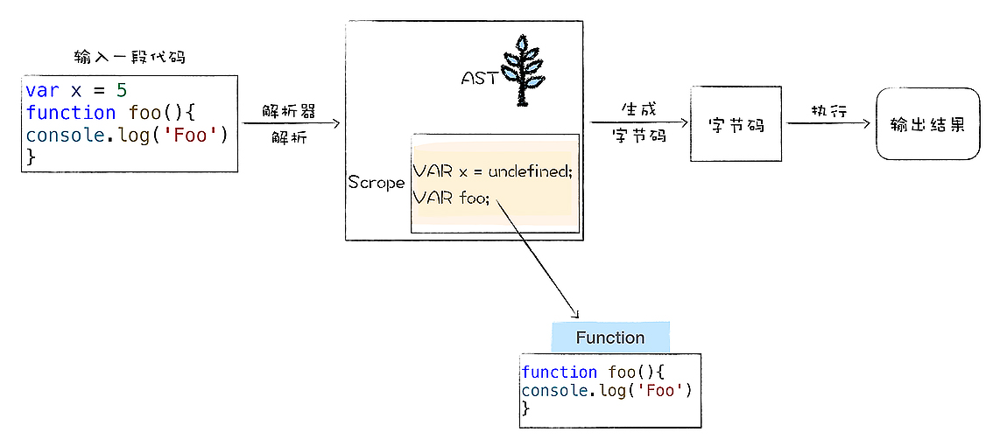

函数表达式在 JavaScript 中非常基础也非常重要，使用函数表达式可以用来实现代码隐藏，还可以实现变量隔离，所以函数表达式被广泛地应用。

## 函数声明与函数表达式的差异


实际上，函数表达式与函数声明有着本质上的差异。

```javaScript
foo()
function foo(){
  console.log('foo');
}
```
上面这段代码可以正常执行，而下面这段却会报错:`Uncaught TypeError: foo is not a function`

```javaScript
foo()
var foo = function(){
  console.log('foo');
}
```
主要原因是，两种定义函数的方式有不同的语义，不同的语义出发了不同的行为：


## V8 是怎么处理函数声明的
函数声明定义了一个具有指定参数的函数，声明语法如下：

```javaScript
function name([param[,param[...,param]]]) {
  [statements]
}
```
V8 在执行 JavaScript 过程中，会先对其进行编译，然后再执行：
```javaScript
var x = 5
function foo() {
  console.log('Foo')
}
```
V8 执行流程大致如下：


在编译阶段，如果解析到函数声明，那么 V8 会将这个函数声明转换为内存中的函数对象，并将其放到作用域中。如果解析到了变量声明，将其赋值为 `undefined`并放入作用域中。

然后在执行阶段，如果使用了某个变量或函数，V8 就去作用域中查找相关内容。

在编译阶段，将所有的变量提升到作用域的过程称为**变量提升**。

所以为什么，普通变量提升之后值都是`undefined`，声明的函数提升之后就是函数对象呢？这涉及到表达式和语句的区别。

**表达式和语句的区别：**
表达式是表示值的式子，语句是操作值的式子。
```javascript
x = 5; // 表达式，会返回一个值 5，5 === 6 同样是一个表达式，返回 false
var x; // 语句，定义了一个变量，并不会返回值
```


了解了两者的区别之后，以下面这段代码为例进行分析：
```javascript
console.log(x)
console.log(foo)
var x = 5
function foo(){}
```

其中 `var x = 5` 会被认为是两段代码，一段是定义变量的语句，一段是赋值的表达式。如下所示：
```javascript
var x // 默认值为 undefined
x = 5
```
这两段代码在不同的阶段执行，`var x` 在编译阶段完成，也就是变量提升阶段。`x = 5` 是表达式，所有的表达式都是在执行阶段完成的。

而函数声明是一个语句（因为执行它并不会输出任何东西），所以 V8 在变量提升阶段，如果遇到函数声明，会将整个函数对象提升到作用域中。

总的来说，V8 在解析 JavaScript 源码的过程中，如果遇到普通的变量声明，那么便会将其提升到作用域中，并赋值为`undefined`。如果遇到函数声明，会为声明生成函数对象，并将该对象提升到作用域中。


## V8 怎么处理函数表达式？

**我们在一个表达式中使用 function 来定义一个函数，那么就把该函数称为函数表达式。**
```javascript
foo()
var foo = function () {
  console.log('foo')
}
```

```javascript
var foo = undefined; // 声明
foo = function () {   // 表达式
  console.log('foo')
}
```

`var foo = undefined` 是声明语句，所以在解析阶段，就会把该变量放入作用域，并赋值为 undefined，第二行是表达式，在编译阶段不会进行处理。


## 立即调用的函数表达式（IIFE）
JavaScript 中的 IIFE 正是利用了 V8 在编译阶段并不会处理函数表达式这个特性。
```javascript
(a=3)
```
在 JS 中，圆括号里面可以放一个表达式。所以如果在小括号里面放上一段函数的定义：
```javascript
(function(){
  // ...
})
```
V8 会将这个函数看成函数表达式，执行时会返回一个函数对象。所以直接在表达式后面加上调用的括号，这就是 IIFE。
```javascript
(function(){
  // ...
})()
```
因为是表达式，所以在 V8 编译阶段，并不会为该表达式创建对象。**这样的一个好处就是不会污染环境，函数和函数内部的变量都不会被其他代码访问到。**

## 总结

函数声明和变量声明类似，在编译阶段 V8 会对其执行变量提升操作，提升到作用域中。区别在于，将变量提升到作用域中时，会对其设置默认值 undefined；如果是函数声明，则会在内存中为该函数创建对象，并提升整个函数对象。

函数表达式也是表达式的一种，在编译阶段不会将表达式中的函数对象提升到作用域中，所以无法在表达式之前使用该函数。

```
var n = 1;
(function foo(){
  console.log(9)
}())
console.log(n)
```
```
var n = 1;
function foo(){
  n = 100
  console.log(n)
}
console.log(n)
foo()
```


